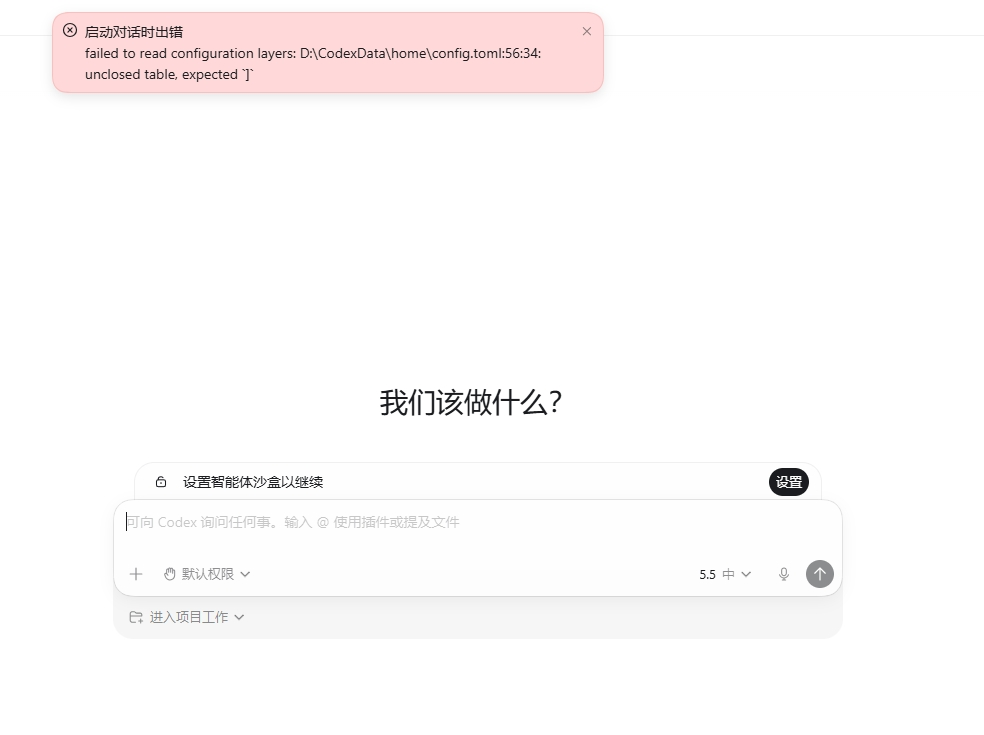

# 上传搜推素材插件使用文档

本文档是“上传天猫搜推素材”Codex Plugin 的 Windows 11 使用说明。

## **一、安装方式**

### Windows安装

#### **1\. 安装前准备**

安装前，请先确认以下事项：

1. 电脑上已经安装并登录 Codex 桌面应用。

2. 准备千牛后台账号，并确保当前 Windows 用户已经能够访问公司 NAS。NAS 配置见：https://kocotree\.feishu\.cn/drive/folder/VCQEf70tUlFGXddwkk3cs5A5nLh?from=from\_copylink。

#### **2\. 推荐安装方法：让 Codex 帮你安装**

最简单的安装方法，不需要自己打开终端或输入安装命令。

1. 打开 Codex 桌面应用。

2. 新建一个任务。

3. 将下面整段文字复制到输入框中，然后发送：

```Plain Text
请帮我安装“上传天猫搜推素材”的Plugin，安装命令是：
codex.cmd plugin marketplace add https://github.com/kocotree/tmall-search-materials-upload.git --ref win --json
codex.cmd plugin add tmall-search-materials@tmall-materials-team --json
请完成团队插件来源添加、安装和启用，并在安装完成后检查状态，告诉我安装是否成功以及当前版本号。
```

4. 等待 Codex 自动处理安装。

5. 如果页面询问是否允许访问网络、访问 GitHub 或执行安装操作，点击“允许”或“继续”。

6. 等待 Codex 明确回复“安装成功”或给出安装结果。

#### **3\.  确认是否安装成功**

安装完成后，请检查 Codex 的回复。


1. 确认结果中出现插件名称 `tmall-search-materials`。

2. 确认插件状态包含 `installed` 和 `enabled`。

3. `installed` 表示“已安装”，`enabled` 表示“已启用”。两项同时出现才表示可以正常使用。

## 二、删除插件

### Windows删除

给codex输入提示词：

```Plain Text
请帮我删除“上传天猫搜推素材”的Plugin，删除命令是：
codex.cmd plugin remove tmall-search-materials@tmall-materials-team --json
codex.cmd plugin marketplace remove tmall-materials-team --json
```

上面会移除 Plugin 和 Marketplace，但会保留任务记录、运行环境及本机配置。

**彻底删除插件**（包括插件的运行时目录）：

```Plain Text
请帮我删除“上传天猫搜推素材”的Plugin，删除命令是：
codex.cmd plugin remove tmall-search-materials@tmall-materials-team --json
codex.cmd plugin marketplace remove tmall-materials-team --json
同时，删除上面的插件之后，还需要删除这个插件相关的运行时目录，如果有进程占用，直接杀掉进程。
```

## **三、新建素材上传任务**

1. 启动codex（ChatGPT）并创建一个项目：


2. 直接输入：

```PowerShell
使用插件帮我完成上传搜推素材的任务
```


即可开始正常上传素材的任务。

**注意：**

1. 整个过程中建议使用5\.6sol模型（推理强度选择中），不会消耗多少token。

2. 最好每一次新的上传任务就开启新的一轮会话，避免上下文污染。

3. 第一次启动时会帮你安装初始环境，这个步骤只有第一次启动会有：


## **四、登录千牛后台**

启动的过程中，工作流会自动弹出千牛后台的登录页面，输入账号完成登录即可。输入完成之后，**切记不要关闭登录后的浏览器，因为后续自动化是在这个页面上进行的，****可以最小化，但不要关闭浏览器，整个过程中不要动这个页面\!\!\!**


## **五、工作台启动**


工作流会帮你自动启动一个工作台，一路点击允许即可，后续所有操作按照工作台里面的指引进行操作就行。

没有自动打开工作台时，点击文字中的链接也可以打开工作台：


建议复制下面这个url，在浏览器中打开，不要使用内置浏览器。


## **六、任务配置**

进入工作台之后，就需要在配置页进行配置：

### 确认索引

索引是为了快速匹配对应商品的素材的，这个步骤大部分情况可以不用管，系统会自动检测到索引位置的。前提是你已经连接了公司的nas。

你可以点击检测一下索引是否生效：


**一般情况下，你不用管这个环节！！！**

### 授权飞书

授权飞书是为了得到最新负责人信息以及记录提交记录到多维表格。


点击按钮进行授权，我这里是已经授权过了，所以是重新授权。

### 选择素材源


也是系统自动帮你匹配好的。前提是你已经连接了公司的nas。

一般是默认加载是这**五个图片源**：

- Z:\\浙江酷趣\\运营中心\\营销板块\\小红书koc置换\&买家秀\\优质买家秀

- Z:\\浙江酷趣\\运营中心\\营销板块\\小红书koc置换\&淘宝买家秀\\优质买家秀

- Y:\\视觉部\\1\-模特图

- Z:\\浙江酷趣\\素材共享库\\01 小红书

- Z:\\浙江酷趣\\素材共享库\\02 天猫买家秀

你也可以添加新的素材源，并且点击保存到常用图片源，这样下次启动工作台填的就是你的常用图片源，而不是上面五个默认图片源了。


**大部分情况下（你没有其他图片源），这个环节也是不需要管的，使用默认图片源即可！！！**

直接点击“提交给工作台”按钮即可。


**所以说任务配置整个环节，只要你配置了nas源，授权了飞书账号，大部分情况下直接点击提交给工作台即可！！！**

## 七、素材完整度巡检与选择

等待自动流爬取千牛后台的空坑位，底部可以看到进度（自动爬取过程中，不要动浏览器，这个过程可能需要个几分钟）：


爬取空坑位之后，勾选空坑位，可以根据条件进行选择（**建议选择30\~80个坑位**）：


选择过滤条件之后，勾选空缺素材的坑位再提交给工作台即可。


## 八、素材匹配

提交坑位之后，工作流就会自动帮你匹配候选文件夹，你可以审批一下哪些文件夹需要采用或者排除。

**我是精确匹配文件夹的，所以基本都是符合的，但是也有名称比较相似的会导致匹配错误，如下所示：**


一般由红字提示的，就是名字不是很匹配的，所以默认我是不选中的，所以如果这个商品的候选文件夹比较少的话，可以手动选中一些进来。

确定候选文件夹之后，点击确认文件夹并加载图片（这个过程需要等个一会，因为是从nas加载的，**网络对nas io的影响很大，建议在网络好的时候进行素材上传**）。


确认之后查看进度：


一般一个商品100张图片，所以四个商品是400张（图片充足的情况下）。

加载完素材之后就是选择素材（直接点击图片就行），根据后台缺少多少篇进行选择素材，导航栏会给出提示，我是按照一个坑位最少三张的要求进行计算缺少多少张素材的（所以选择的时候可以多选一点）：


一般先加载30张，如果一批不满意可以换一批，但是总共只有100张：


千牛后台对于素材的要求工作流都已经检测完毕了，比如图片再200kb～20Mb的范围内，**无法选择的就是不满足要求的（如低于200kb的素材无法选择）。**


选择素材时，首先**推荐的是点击“一键为全部商品选图”按钮**，系统自动帮你选可能要稍等一会，等到都帮你选好之后你再进行检查一下，排除掉不需要的素材，增加更好的素材：


下面这里显示选图的进度：


当然你也可以**不选择点击“一键为全部商品选图”按钮**，自己一张一张选择。

选好之后，点击“提交给工作台”


## **九、坑位编排和文案填充**

提交给工作台之后，工作台会帮我们自动编排坑位。

我们可以进行调整，比如把一个素材从一个坑位删除，添加到另一个坑位，但注意一个坑位不少于三张图片。

确认坑位之后就点击进入图片裁剪：


调整方框即可，一般图片都是3:4


没有方框的是不需要调整的，如下面两个：


调整后，还要点击预裁剪检测，判断裁剪之后是否符合200kb～20Mb等要求。（这个过程会稍微有点久）


如果检测出现问题，两种方法解决：

1. 找到出问题的坑位，删掉该坑位，重新加载


2. 再选择素材时每个坑位多补充几张图片，把有问题的图片空坑位后移除再添加。


检测之后，就可以点击进入文案生成了。


进入文案生成页面的话，什么都不用做，直接等待即可，**这个过程也会比较久，你可以做自己的事情。如果过程中看到浏览器不动了，也不用管，可能会小概率失败，但是我设置了重试机制和跳过的机制，会有一些跳过没有补充的标题和描述词需要自己选（概率很小）。**

直到所有的坑位都填满了标题和描述词，确认一下是否描述和提示词填写正确。然后点击按钮进入上传任务确认。


注意：如果有跳过的坑位或者中断没有完成的坑位，则点击**继续获取**或者自己手动补上标题和描述词：


## **十、提交确认**

点击自动上传（上传的过程也会比较久，可不用管去做其他事就行）。


上传成功：


或者也可以在多维表格中查看上传记录：[上传记录表](https://kocotree.feishu.cn/base/ILuDbCBBpazXSXsvlbOcivzWnBa?table=tblwmAmcvqayyt2b&view=vewiTrKDWh)

## 十一、结束任务

你可以等被动释放进程，如下8分16秒后结束任务，也可以直接点击结束当前任务释放后台进程。


释放后刷新浏览器，页面无法访问。


## **十二、版本更新**

Plugin 版本号可在工作台顶部或 `codex.cmd plugin list --json` 的输出中查看：


正常更新时，先结束当前工作台，再直接给 Codex 输入：

```PowerShell
帮我把插件“上传天猫搜推素材”进行更新，相关命令如下：
codex.cmd plugin marketplace upgrade tmall-materials-team --json
codex.cmd plugin remove tmall-search-materials@tmall-materials-team --json
codex.cmd plugin add tmall-search-materials@tmall-materials-team --json
codex.cmd plugin list --json
请核对插件已安装、已启用，告诉我当前版本号和来源分支。
```

如果原来安装的是私人 Gitee 来源，第一次迁移到公司 GitHub 时使用：

```PowerShell
请帮我把“上传天猫搜推素材”Plugin 从旧的 Gitee 来源迁移到公司 GitHub：
codex.cmd plugin remove tmall-search-materials@tmall-materials-team --json
codex.cmd plugin marketplace remove tmall-materials-team --json
codex.cmd plugin marketplace add https://github.com/kocotree/tmall-search-materials-upload.git --ref win --json
codex.cmd plugin add tmall-search-materials@tmall-materials-team --json
codex.cmd plugin list --json
请核对 Marketplace 来源是公司 GitHub、source.ref 是 win，并告诉我当前版本号。
```

注意：已经启动的工作台不会自动热更新。安装新版本后，需要从新版本入口重新启动工作台；不要通过反复安装同一个版本号来覆盖旧缓存。

## 十三、插件关联的飞书表格

了解就行：

获取商品信息的表格：[天猫商品信息表](https://kocotree.feishu.cn/wiki/A5x4wrZiBimLFWknwk8ccOwznY4?from=from_copylink)

上传成功之后记录的表格：[上传记录表](https://kocotree.feishu.cn/base/ILuDbCBBpazXSXsvlbOcivzWnBa?from=from_copylink)

## **十四、问题记录**

|提交人|问题|现象|是否解决|
|---|---|---|---|
|||||
|||||
|||||
|||||

解决之后会发布新版本，按照上面的方式更新就可以了。

## 十五、常见问题和解决方式

### 问题一：安装之后出现一下情况：



这是中文路径（你的codex项目文件夹用了中文名称）在配置文件中乱码的问题。

直接把这个toml文件给我@张权龙\&虾米，我帮你恢复。

### 问题二：Selected model is at capacity\. Please try a different model\.


这是Codex自身出现的bug，不用管。

### 问题三：安装环境报错


第一次启动需要安装环境，后面启动就不需要了，如果安装环境出错的话，检查一下网络，多试几次（网络抖动会出现失败的问题）。

### 问题四：定期清理空间

任务过程中产生的任务状态文件夹存在：C:\\Users\\Administrator\\AppData\\Local\\Packages\\OpenAI\.Codex\_2p2nqsd0c76g0\\LocalCache\\Local

这里主要存放的是任务状态、日志、预览、处理后的图片和审计记录。如果空间不够，可以定期进行清理。

### 问题五：风控问题


自动化的过程中，可能会出发风控，滑动一下即可。但出现的情况一般很少。
