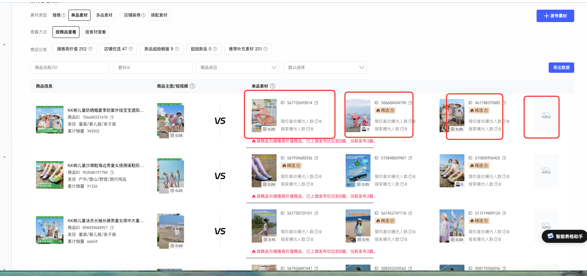

# 搜推素材

入口

\.png" />

## 基础素材

\.png" />

1  排查巡检哪些产品素材是没有上传完整的；

2 去除一些不需要维护的款式：uvno的、清仓的、好物体验类

3 来源：场景图\-\-nas里面的模特图；nas账号找法棍开通\-\-\-视觉部的文件夹；

4 种草素材图\-\-模特库内的图；小红书的图；小红书的图存放在nas；

## 搜推素材

\.png" />

1 坑位要求全部传满；

2 有9坑的，9坑传满；

3 去除一些不需要维护的款式：uvno的、清仓的、好物体验类。会员日。积分这种不用管；

上传格式：发图文、发视频两种类型：1 图视频都有的，三坑的一个视频两个图文；9坑的可以三视频6图文；2 只有图文没有视频的：优先发图文；

\.png" />

\.png" />

1 上传素材

2 图片尺寸不合适的话上传之后进行一次裁剪或者是提前处理好图片尺寸

3 标题：KK树\+年龄或性别\+品类词\+卖点词

4 内容描述：一段卖点描述性介绍，可以让ai写

5 视频同理；

素材来源：

1 小红书图\-\-\-nas或者飞书表格文档

2 光合短视频\-\-\-可以找麦芽了解下短视频下载入口
