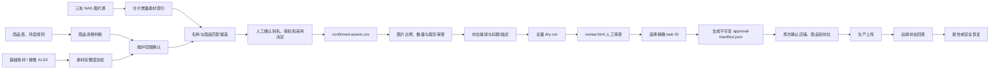

# 搜推素材

入口

\.png" />

## 基础素材

\.png" />

1  排查巡检哪些产品素材是没有上传完整的；

2 去除一些不需要维护的款式：uvno的、清仓的、好物体验类

3 来源：场景图\-\-nas里面的模特图；nas账号找法棍开通\-\-\-视觉部的文件夹；

4 种草素材图\-\-模特库内的图；小红书的图；小红书的图存放在nas；

## 搜推素材

\.png" />

1 坑位要求全部传满；

2 有9坑的，9坑传满；

3 去除一些不需要维护的款式：uvno的、清仓的、好物体验类。会员日。积分这种不用管；

上传格式：发图文、发视频两种类型：1 图视频都有的，三坑的一个视频两个图文；9坑的可以三视频6图文；2 只有图文没有视频的：优先发图文；

\.png" />

\.png" />

1 上传素材

2 图片尺寸不合适的话上传之后进行一次裁剪或者是提前处理好图片尺寸

3 标题：KK树\+年龄或性别\+品类词\+卖点词

4 内容描述：一段卖点描述性介绍，可以让ai写

5 视频同理；

素材来源：

1 小红书图\-\-\-nas或者飞书表格文档

2 光合短视频\-\-\-可以找麦芽了解下短视频下载入口

## 整体流程

具体可以分为五个部分。

### 1. 确定本轮要维护哪些商品

输入包括：

- 商品总表
- 目标月份
- 月度推品规则
- 基础素材和搜推素材后台导出

系统先排除：

- 清仓
- UVNO
- 好物体验类
- 会员日
- 积分商品
- 不属于本月目标品类或等级的商品

每个商品都必须留下 `eligible`、`excluded` 或 `blocked` 结果，不能静默消失。

### 2. 检查商品还缺什么素材

结合后台导出或后续只读补采，判断：

- 商品需要 3 坑还是 9 坑
- 当前已经有多少素材
- 缺少哪些坑位
- 当前审核状态是否完整
- 是否需要补图文或视频

这个阶段只巡检，不上传。当前视频规则还没有确认，所以视频保持延期或 blocked。

### 3. 从三处 NAS 找到可用图片

这就是现在正在补的“分片增量素材索引器”。

它的职责是：

1. 扫描三处 NAS，但不修改原文件。
2. 第一阶段只记录路径、大小、mtime、来源和名称线索。
3. 根据商品 ID、SKU、商品名称、目录名称产生候选。
4. 商品 ID 是精确匹配，SKU 是后备匹配。
5. 商品名称只能成为人工候选，不能自动确认。
6. 对进入候选的图片再计算 SHA-256、尺寸和比例。
7. 用户在页面确认别名、授权状态以及采用或排除。
8. 确认后生成可供后续 dry-run 使用的素材清单。

拟议的三个文件分别承担不同责任：

- `asset-index.sqlite3`：全量快速索引和断点进度。
- `match-candidates.csv`：等待人工确认的名称候选。
- `confirmed-assets.csv`：人工确认后才能进入 dry-run 的正式素材清单。

索引器本身不会上传任何图片。

### 4. 生成可审查的上传任务

通过人工确认的图片还要继续检查：

- 是否已确认授权
- 图片是否可读
- 是否重复
- 数量是否满足每个图文坑位 3–9 张
- 比例是否为允许的 `3:4` 或 `1:1`
- 是否需要裁剪
- 是否满足三坑或九坑编排
- 标题是否符合“KK树＋年龄或性别＋品类词＋卖点词”
- AI 描述是否有事实依据并经过人工确认

之后执行全量 `dry-run`，生成：

- 商品级任务
- 坑位级任务
- `material-items.json`
- `review.html`
- `run.sqlite3`
- 中文报告

到这里仍然不会上传。

### 5. 获得明确批准后才允许生产上传

生产阶段必须满足：

1. 用户在当前对话再次授权真实上传。
2. 用户在 `review.html` 中选择精确 task ID。
3. 生成不可变的 `approval-manifest.json`。
4. 上传前重新核对店铺、商品、坑位、图片 SHA-256 和文案哈希。
5. 每个任务最多点击一次发布。
6. 发布后回查远端素材 ID、坑位和审核状态。
7. 结果不确定时进入 `publish_uncertain`，停止并回查，不能盲目重传。

交互网页只负责收集信息、保存 JSON 和展示结果；真正的 dry-run、批准和上传都由 Agent 调用受控 CLI 执行。

当前项目进度是：

- 测试环境：通过。
- 交互页面与时间戳任务隔离：通过。
- 三处 NAS 只读预检：完成，共发现 413,309 张图片。
- 分片增量素材索引器：待实现。
- 人工素材匹配、图片策略、全量 dry-run：尚未完成。
- 生产上传：未测试，也未获得授权。

因此，我们刚才讨论的输出结构只影响“第 3 部分：从 NAS 建立素材清单”，不会直接触发后面的上传流程。
